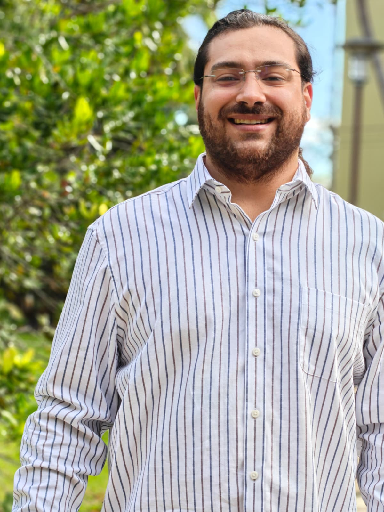

::: {.page-hero}
# About

I am a conservation agronomist and master's student in Biology at the University of Puerto Rico at Mayagüez, working across wildlife disease ecology, conservation physiology, One Health, reproductive biology, and environmental health.
:::

::: {.section-block}

::: {.about-split}

::: {.about-copy}
## Academic background

My academic path combines Animal Science, Natural Resources Management, Conservation and Development, and Environmental Sociology and Public Policy. This combination shaped how I think about biology: not only as the study of organisms, but also as the study of ecosystems, landscapes, communities, policy, and the social conditions that influence conservation outcomes.

My current graduate work focuses on *Toxoplasma gondii* at the land-sea interface in Puerto Rico, with emphasis on environmental transmission pathways and conservation implications for the endangered Caribbean manatee.
:::

::: {.about-photo}

:::

:::

:::

::: {.section-block}

## Find my path

::: {.audience-grid}

::: {.audience-card}
### Academic formation

Animal Science, Natural Resources Conservation Management and Development, Environmental Sociology, and Public Policy.
:::

::: {.audience-card}
### Research direction

Wildlife medicine and disease ecology, One Health, conservation physiology, reproductive biology, environmental diagnostics, and reproducible science.
:::

::: {.audience-card}
### Conservation identity

Puerto Rican island science, watershed-to-coast thinking, landscape thinking, wildlife health, and community-centered conservation.
:::

:::
:::

::: {.section-block}

## Academic path

::: {.academic-timeline}

::: {.academic-step}
::: {.timeline-dot}
1
:::
::: {.timeline-card}
### Agricultural and animal science foundation

My academic formation began in Animal Science, where I developed a technical foundation in agriculture, animal biology, physiology, production systems, and applied biological sciences.

::: {.badge-row}
[Animal Science]{.status-badge .badge-type}
[Agriculture]{.status-badge .badge-theme}
[Applied biology]{.status-badge .badge-theme}
:::
:::
:::

::: {.academic-step}
::: {.timeline-dot}
2
:::
::: {.timeline-card}
### Conservation, natural resources, and society

I expanded my training through Natural Resources Conservation and Development, Environmental Sociology, and Public Policy. This helped me think about conservation as both a biological and social process shaped by ecosystems, communities, policy, and environmental change.

::: {.badge-row}
[Natural resources]{.status-badge .badge-theme}
[Environmental sociology]{.status-badge .badge-theme}
[Public policy]{.status-badge .badge-theme}
:::
:::
:::

::: {.academic-step}
::: {.timeline-dot}
3
:::
::: {.timeline-card}
### Transition into wildlife health and disease ecology

My interests moved toward wildlife disease ecology, conservation physiology, One Health, and the ways pathogens, landscapes, domestic animals, humans, and wildlife are connected through shared environments.

::: {.badge-row}
[Wildlife disease ecology]{.status-badge .badge-active}
[Conservation physiology]{.status-badge .badge-theme}
[One Health]{.status-badge .badge-theme}
:::
:::
:::

::: {.academic-step}
::: {.timeline-dot}
4
:::
::: {.timeline-card}
### M.S. Biology at UPRM

As a master's student in Biology at the University of Puerto Rico at Mayagüez, my graduate research focuses on *Toxoplasma gondii* transmission across the land-sea interface in Puerto Rico and its potential conservation implications for the endangered Caribbean manatee.

::: {.badge-row}
[M.S. Biology]{.status-badge .badge-type}
[Manatee Project Puerto Rico]{.status-badge .badge-active}
[*Toxoplasma gondii*]{.status-badge .badge-theme}
:::
:::
:::

::: {.academic-step}
::: {.timeline-dot}
5
:::
::: {.timeline-card}
### Reproducible research and project ecosystems

I am building my work around reproducible research practices using R, RStudio, GitHub, Quarto, environmental data, molecular diagnostics, and project-specific websites that can grow into long-term research and outreach platforms.

::: {.badge-row}
[R]{.status-badge .badge-theme}
[GitHub]{.status-badge .badge-theme}
[Quarto]{.status-badge .badge-theme}
[Project websites]{.status-badge .badge-coming}
:::
:::
:::

::: {.academic-step}
::: {.timeline-dot}
6
:::
::: {.timeline-card}
### Future direction

My long-term path is oriented toward wildlife health, veterinary science, conservation physiology, reproductive biology, One Health, and research that supports threatened species conservation, community-based science, and environmental decision-making.

::: {.badge-row}
[Future DVM/PhD pathway]{.status-badge .badge-developing}
[Wildlife health]{.status-badge .badge-theme}
[Conservation medicine]{.status-badge .badge-theme}
:::
:::
:::

:::
:::

::: {.section-block}

## Conservation identity

I am interested in conservation science that begins with real ecological problems and moves toward useful evidence. My work is rooted in the idea that wildlife health cannot be separated from landscapes, communities, domestic animals, infrastructure, environmental change, and policy.

Puerto Rico is central to my scientific identity. Island systems make connections visible: mountains to rivers, cities to estuaries, cats to coastal waters, pathogens to wildlife, and communities to conservation action.

:::

::: {.section-block}

## Professional direction

I describe myself as a conservation agronomist because my academic foundation began in agriculture and animal science, but my current work extends into wildlife health, disease ecology, conservation physiology, environmental diagnostics, bioinformatics, and One Health.

My long-term goal is to build a career that integrates wildlife disease ecology, veterinary science, comparative physiology, reproductive biology, and conservation research.

:::

::: {.section-block}

## Current academic home

**Department of Biology**  
University of Puerto Rico at Mayagüez  

**ViDaB Lab**  
Virus Diversity and Bioinformatics Laboratory  

:::