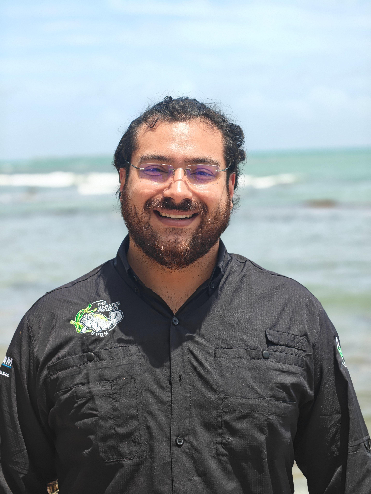
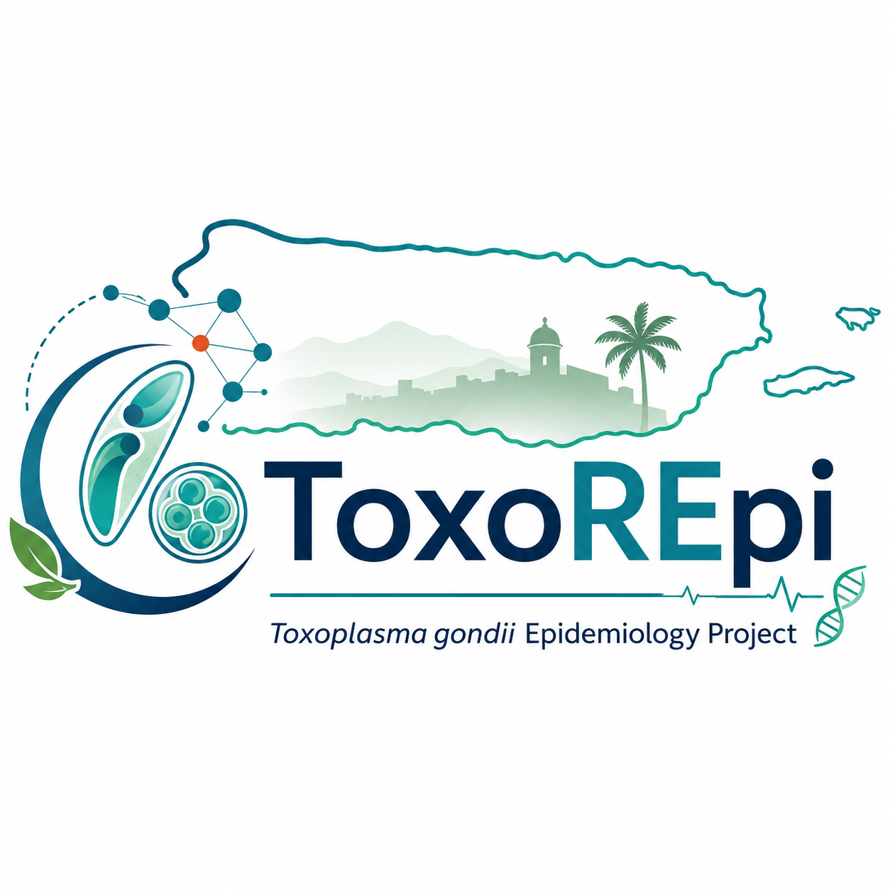
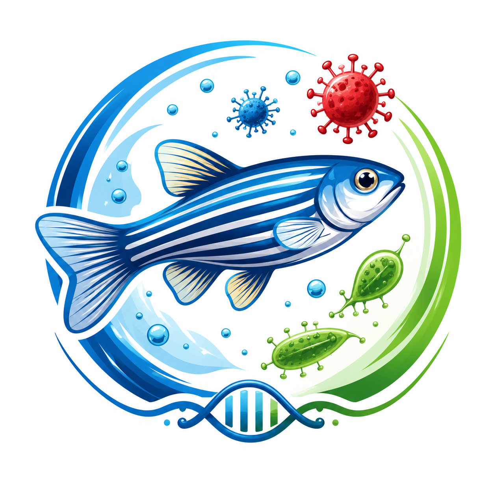
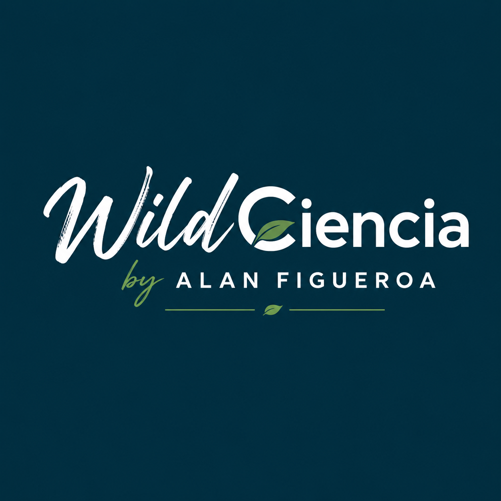

::: {.home-hero}
::: {.hero-inner}

::: {.eyebrow}
Conservation Physiology | Wildlife Medicine and Disease Ecology | Reproductive Biology | One Health
:::

# Alan J. Figueroa Ruiz

## Conservation agronomist and M.S. Biology student studying how pathogens, environmental change, and human activity shape wildlife health.

::: {.hero-text}
My work focuses on *Toxoplasma gondii* transmission across terrestrial, estuarine, and marine systems in Puerto Rico, with emphasis on environmental pathways, conservation physiology, One Health, and implications for the endangered Caribbean manatee.
:::

::: {.hero-actions}
[Explore research](research.qmd){.button-primary}
[View projects](projects.qmd){.button-secondary}
[View CV](cv.qmd){.button-secondary}
:::

:::
:::

::: {.portal-strip}

::: {.portal-item}
::: {.portal-label}
Academic home
:::
::: {.portal-text}
University of Puerto Rico at Mayagüez
:::
:::

::: {.portal-item}
::: {.portal-label}
Research focus
:::
::: {.portal-text}
Pathogen movement across human-modified landscapes
:::
:::

::: {.portal-item}
::: {.portal-label}
Focal system
:::
::: {.portal-text}
*Toxoplasma gondii* at the land-sea interface
:::
:::

::: {.portal-item}
::: {.portal-label}
Portal role
:::
::: {.portal-text}
Hub for research, project websites, teaching, outreach, CV, and future platforms
:::
:::

:::

::: {.pathway-band}

## Find your path

This website is designed as a portal. Different visitors may come here for research, collaboration, teaching resources, outreach, project repositories, or future WildCiencia platforms.

::: {.gateway-grid}

::: {.gateway-card}
### For researchers

Explore my research themes, project ecosystem, reproducible workflows, and future project-specific websites.

[Research →](research.qmd)
:::

::: {.gateway-card}
### For students

Find teaching interests, mentorship values, future learning resources, and examples of scientific workflows.

[Teaching →](teaching.qmd)
:::

::: {.gateway-card}
### For collaborators

Learn about active projects, conservation questions, methods, and opportunities to connect.

[Projects →](projects.qmd)
:::

::: {.gateway-card}
### For communities

Explore outreach, WildCiencia, public science communication, and conservation education.

[Outreach →](outreach.qmd)
:::

:::
:::

::: {.section-block .intro-section}

## Welcome

I am a conservation agronomist and master's student in Biology at the University of Puerto Rico at Mayagüez. My academic background combines Animal Science, Natural Resources Conservation and Development, and Environmental Sociology and Public Policy.

My research sits at the intersection of wildlife disease ecology, conservation physiology, One Health, environmental health, reproductive biology, and reproducible research. I am interested in how pathogen exposure, landscape change, stormwater runoff, urbanization, and human activity affect threatened wildlife populations and the ecosystems they depend on.

This website serves as my main academic portal. It connects my research, teaching, outreach, publications, CV, and future project-specific websites.

:::

::: {.section-block}

::: {.profile-feature}

::: {.profile-photo}

:::

::: {.profile-text}
## From island landscapes to wildlife health

My academic path connects agriculture, animal science, natural resources, environmental sociology, and biology. I am especially interested in Puerto Rican island systems because they make ecological connections visible: mountains to rivers, cities to estuaries, cats to coastal waters, pathogens to wildlife, and communities to conservation action.

This portal brings together my research, project websites, outreach, teaching, CV, and future platforms.
:::

:::

:::

::: {.conservation-statement}

## Conservation question

How do pathogens move through human-modified landscapes, and what does that movement mean for wildlife, ecosystems, and communities?

My work approaches this question from Puerto Rico’s land-sea interface, where watersheds, coastal ecosystems, community animals, humans, and endangered marine mammals are connected through shared environmental pathways.

:::

::: {.section-block}

## Project ecosystem

::: {.project-grid}

::: {.project-card .project-card-visual}
{.project-thumb}

### Manatee Project Puerto Rico

Environmental transmission of *Toxoplasma gondii* across terrestrial, estuarine, and marine systems in Puerto Rico.

::: {.badge-row}
[Active thesis project]{.status-badge .badge-active}
[M.S. research]{.status-badge .badge-type}
[One Health]{.status-badge .badge-theme}
[Project site coming soon]{.status-badge .badge-coming}
:::

[Project website →](https://ajfigueroaruiz.github.io/manatee-project-puerto-rico/){.card-link}
:::

::: {.project-card .project-card-visual}
{.project-thumb}

### Human *T. gondii* Epidemiology

Retrospective analysis of diagnostic records to characterize evidence of exposure in Puerto Rico.

::: {.badge-row}
[Manuscript in preparation]{.status-badge .badge-manuscript}
[Epidemiology]{.status-badge .badge-type}
[Reproducible R pipeline]{.status-badge .badge-theme}
[Project site coming soon]{.status-badge .badge-coming}
:::

[Project website →](https://ajfigueroaruiz.github.io/human-toxoplasma-epidemiology-pr/){.card-link}
:::

::: {.project-card .project-card-visual}
{.project-thumb}

### Zebrafish ZF4 Cell Infection Model

Cellular and tissue-based work using zebrafish ZF4 cells infected with *Toxoplasma gondii*.

::: {.badge-row}
[Developing project]{.status-badge .badge-developing}
[Cell biology]{.status-badge .badge-type}
[Host-pathogen interaction]{.status-badge .badge-theme}
[Project site coming soon]{.status-badge .badge-coming}
:::

[Project website →](https://ajfigueroaruiz.github.io/zf4-toxoplasma-cell-infection/){.card-link}
:::

::: {.project-card .project-card-visual}
{.project-thumb}

### WildCiencia

Science communication and community-based conservation outreach focused on island science.

::: {.badge-row}
[Developing outreach platform]{.status-badge .badge-outreach}
[Science communication]{.status-badge .badge-type}
[Community conservation]{.status-badge .badge-theme}
[Platform coming soon]{.status-badge .badge-coming}
:::

[Project website →](https://ajfigueroaruiz.github.io/wildciencia/){.card-link}
:::

:::

::: {.note-box}
These project links are designed for future project-specific GitHub Pages websites. They may show a temporary 404 until each individual project repository is created and published.
:::

:::

::: {.section-block}

## Field-to-conservation framework

::: {.expedition-grid}

::: {.expedition-card}
### 1. Landscapes

Watersheds, coastal cities, estuaries, mangroves, seagrass habitats, and manatee-use areas.
:::

::: {.expedition-card}
### 2. Exposure

Environmental contamination, runoff, stormwater pathways, and potential pathogen transport.
:::

::: {.expedition-card}
### 3. Evidence

Field metadata, environmental samples, microscopy, molecular diagnostics, and reproducible analysis.
:::

::: {.expedition-card}
### 4. Action

Conservation interpretation, student training, outreach, and community-centered communication.
:::

:::
:::

::: {.section-block}

## Focal systems

::: {.species-grid}

::: {.species-card}
### Caribbean manatee

Endangered marine mammal conservation, coastal habitat use, environmental exposure, and One Health relevance.
:::

::: {.species-card}
### *Toxoplasma gondii*

A land-to-sea pathogen system linking cats, runoff, humans, wildlife, and coastal ecosystems.
:::

::: {.species-card}
### Puerto Rican watersheds

Urbanized and coastal watersheds as pathways connecting terrestrial environments to estuaries and marine habitats.
:::

::: {.species-card}
### Comparative models

Zebrafish ZF4 cells and cellular approaches that connect exposure questions to host-pathogen biology.
:::

:::
:::

::: {.section-block}

## Project ecosystem

::: {.project-grid}

::: {.project-card}
### Manatee Project Puerto Rico

Environmental transmission of *Toxoplasma gondii* across terrestrial, estuarine, and marine systems in Puerto Rico, with conservation relevance for the endangered Caribbean manatee.

**Status:** Active thesis project  
**Themes:** Wildlife disease ecology · One Health · Marine mammal conservation

[Project website →](https://ajfigueroaruiz.github.io/manatee-project-puerto-rico/){.card-link}
:::

::: {.project-card}
### Human *T. gondii* Epidemiology in Puerto Rico

A retrospective analysis of human diagnostic testing records to characterize evidence of *Toxoplasma gondii* exposure in Puerto Rico.

**Status:** Manuscript in preparation  
**Themes:** Epidemiology · Public health · Reproducible R pipeline

[Project website →](https://ajfigueroaruiz.github.io/human-toxoplasma-epidemiology-pr/){.card-link}
:::

::: {.project-card}
### Zebrafish ZF4 Cell Infection Model

A cellular and tissue-based project using zebrafish (*Danio rerio*) ZF4 cells infected with *Toxoplasma gondii*.

**Status:** Developing project  
**Themes:** Cell biology · Host-pathogen interaction · Comparative models

[Project website →](https://ajfigueroaruiz.github.io/zf4-toxoplasma-cell-infection/){.card-link}
:::

::: {.project-card}
### WildCiencia

A science communication and outreach initiative focused on wildlife, conservation, One Health, and Puerto Rican island science.

**Status:** Developing outreach platform  
**Themes:** Science communication · Community-based conservation · Education

[Project website →](https://ajfigueroaruiz.github.io/wildciencia/){.card-link}
:::

:::

::: {.note-box}
These project links are designed for future project-specific GitHub Pages websites. They may show a temporary 404 until each individual project repository is created and published.
:::

:::

::: {.section-block}

## News & updates

::: {.news-grid}

::: {.news-card}
### Personal academic portal launched

This website now serves as the central hub for my research, projects, outreach, teaching, CV, and future project-specific websites.

**Category:** Website update
:::

::: {.news-card}
### Human *T. gondii* epidemiology manuscript in preparation

A reproducible R-based epidemiological analysis of human diagnostic records from Puerto Rico is being developed into a manuscript.

**Category:** Research update
:::

::: {.news-card}
### Manatee Project Puerto Rico continues development

The thesis project continues to focus on environmental transmission pathways of *Toxoplasma gondii* and conservation implications for the endangered Caribbean manatee.

**Category:** Thesis research
:::

:::

[View all news →](news.qmd){.button-inline}

:::

::: {.cta-band}

## Build, connect, and translate science

This portal will continue growing into a connected ecosystem of research websites, reproducible repositories, teaching materials, outreach platforms, WildCiencia resources, and future public-facing projects.

[Contact me](contact.qmd){.button-primary-dark}
[View projects](projects.qmd){.button-secondary-dark}

:::