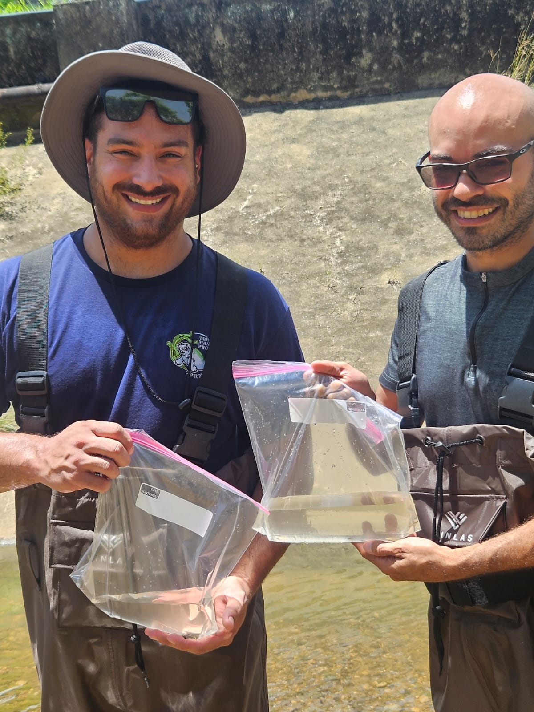
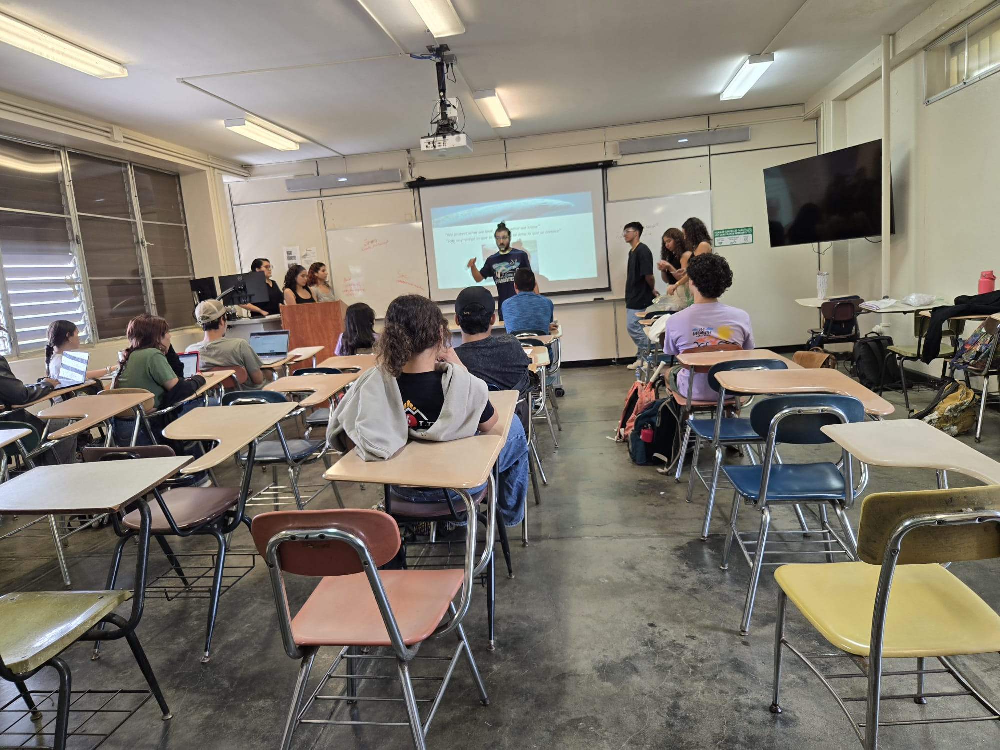
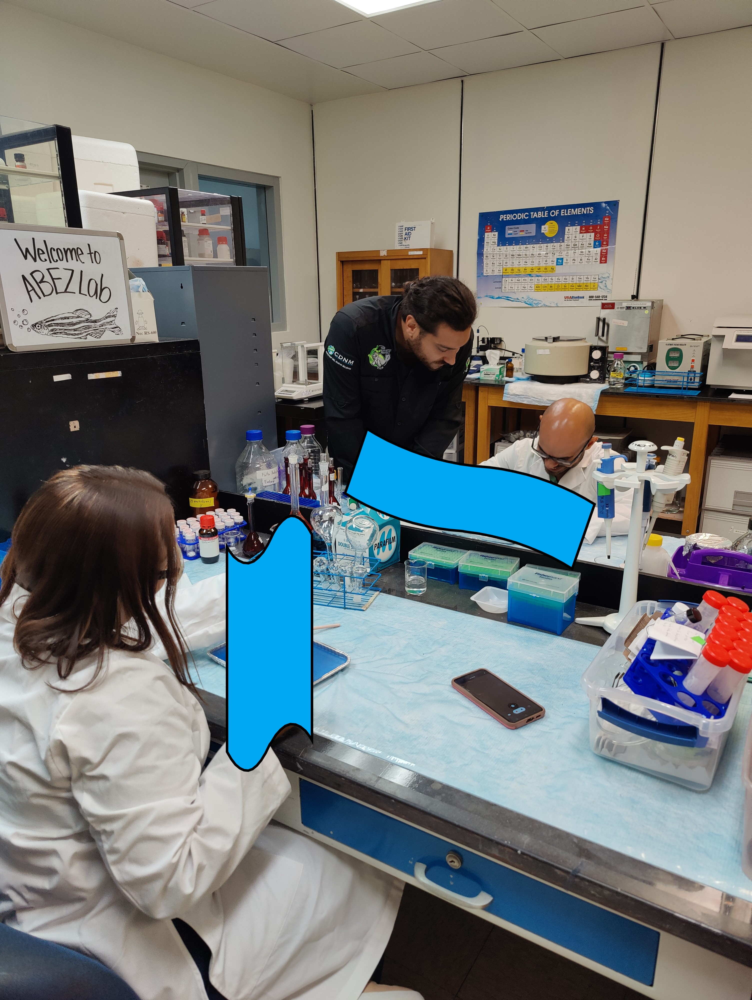
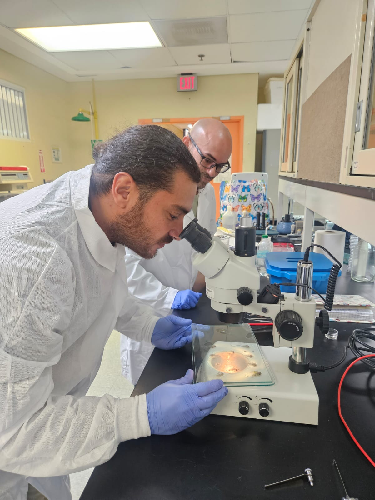
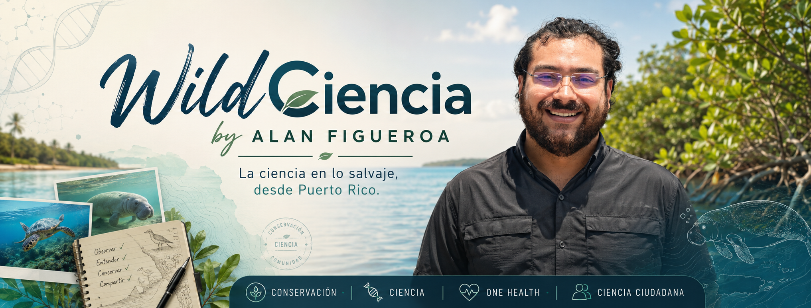
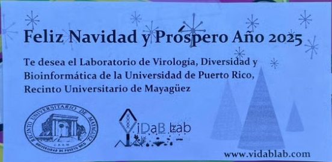
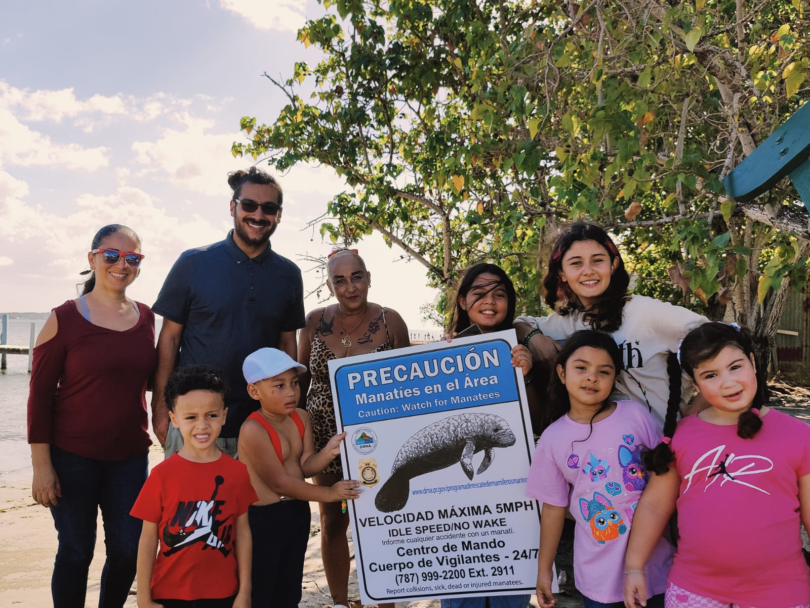
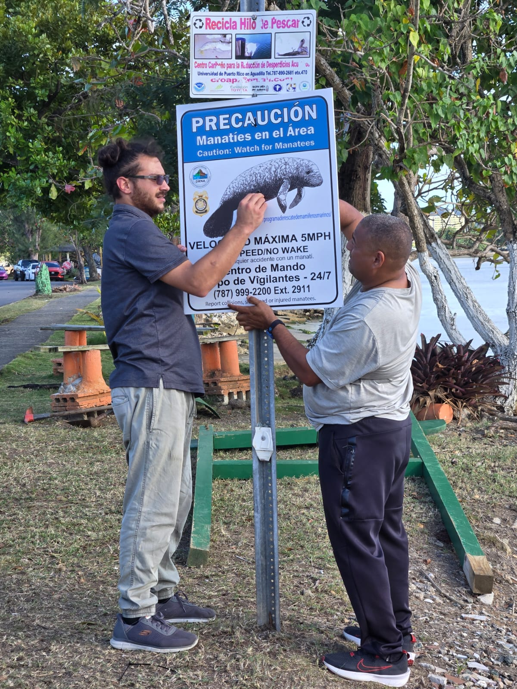
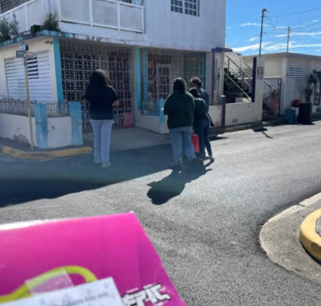
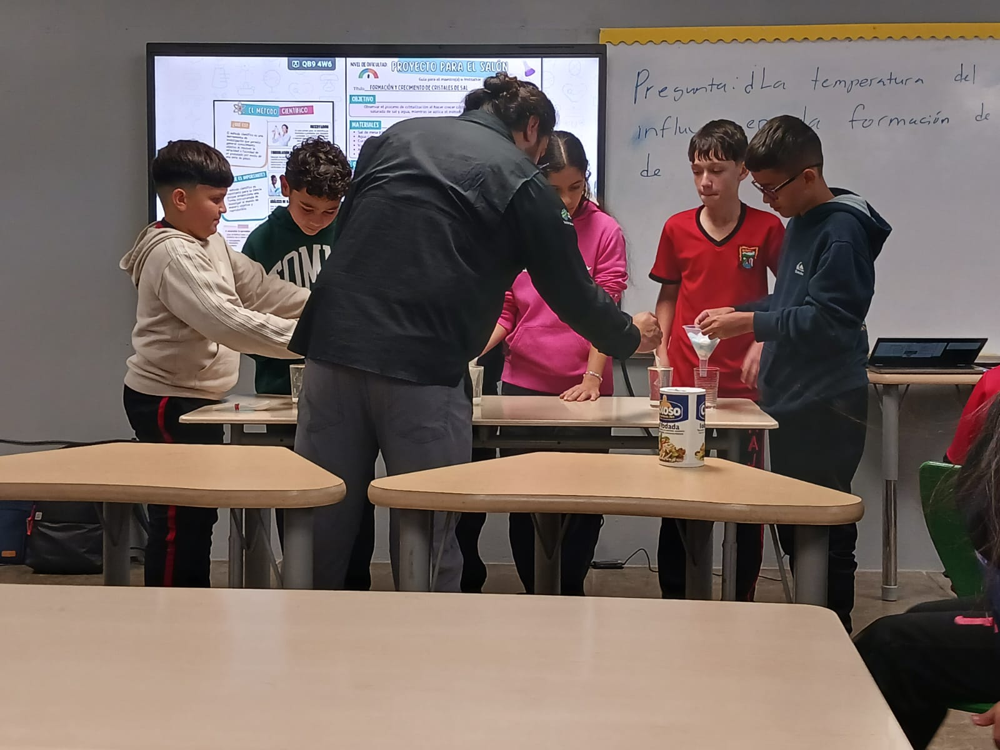

::: {.page-hero}
# Outreach

Community-based science, student training, conservation education, and public-facing One Health communication.
:::

::: {.section-block}

## Outreach pathways

::: {.gateway-grid}

::: {.gateway-card}
### Community

Conservation education connected to local ecosystems, species, and environmental concerns.
:::

::: {.gateway-card}
### Students

Research exposure, fieldwork, laboratory skills, data literacy, and professional development.
:::

::: {.gateway-card}
### WildCiencia

Public-facing science communication, visual storytelling, and future educational resources.
:::

::: {.gateway-card}
### Conservation action

Accessible science that supports belonging, care, and protection of local spaces.
:::

:::
:::

::: {.section-block}

## Outreach vision

I believe conservation becomes stronger when communities are not treated only as audiences, but as partners, knowledge holders, and caretakers of local spaces.

My outreach work is guided by the idea that people protect places more deeply when they develop belonging in those places.

:::

::: {.section-block}

## Community engagement model

::: {.expedition-grid}

::: {.expedition-card}
### Listen

Understand community connections to local ecosystems, species, and environmental concerns.
:::

::: {.expedition-card}
### Translate

Turn technical research into accessible language, visuals, stories, and educational materials.
:::

::: {.expedition-card}
### Train

Support students through research experiences, fieldwork, laboratory exposure, and communication skills.
:::

::: {.expedition-card}
### Return

Bring research knowledge back to communities through outreach, education, and public-facing resources.
:::

:::
:::

::: {.section-block}

## Featured outreach stories

These selected outreach stories document community-based conservation, student training, public education, media engagement, and science communication connected to my work in wildlife disease ecology, One Health, and conservation science.

::: {.outreach-entry}

::: {.outreach-entry-image}

:::

::: {.outreach-entry-content}
### Manatee Conservation Night

::: {.badge-row}
[Community conservation]{.status-badge .badge-outreach}
[Manatee Project Puerto Rico]{.status-badge .badge-active}
[One Health outreach]{.status-badge .badge-theme}
:::

**Focus:** Manatee conservation, coastal ecosystems, environmental health, and community science  
**Format:** Community event, educational activities, and public conservation discussion  
**Related project:** Manatee Project Puerto Rico

Manatee Conservation Night was developed as a community-centered outreach activity connecting marine mammal conservation, environmental health, and public science communication. The event created a space to discuss the conservation of the Caribbean manatee, the importance of coastal ecosystems, and the ways communities can participate in conservation action.

This activity reflects my broader commitment to science that returns to communities, especially in Puerto Rican coastal and island contexts where people, wildlife, watersheds, and ecosystems are deeply connected.
:::

:::

::: {.outreach-entry}

::: {.outreach-entry-image}

:::

::: {.outreach-entry-content}
### Operation Viral Christmas

::: {.badge-row}
[Community outreach]{.status-badge .badge-outreach}
[Student engagement]{.status-badge .badge-theme}
[Science and service]{.status-badge .badge-type}
:::

**Focus:** Community support, student-led engagement, and science-connected outreach  
**Format:** Holiday outreach initiative  
**Related themes:** Community-based science, student training, public engagement

Operation Viral Christmas is a community-oriented outreach initiative that connects science, service, and student engagement. The activity reflects the idea that scientific communities can contribute beyond the laboratory by supporting local communities and building a culture of care, belonging, and public connection.

This initiative also represents the type of outreach I want to continue developing through WildCiencia: science that is visible, human, accessible, and connected to the people and places it serves.
:::

:::

::: {.outreach-entry}

::: {.outreach-entry-image}

:::

::: {.outreach-entry-content}
### Teacher and Student Conservation Workshops

::: {.badge-row}
[Teacher workshop]{.status-badge .badge-type}
[Hands-on science]{.status-badge .badge-theme}
[Environmental education]{.status-badge .badge-outreach}
:::

**Focus:** Field sampling, aquatic organisms, conservation education, and laboratory exposure  
**Format:** Workshop and hands-on training  
**Related themes:** Environmental education, aquatic systems, field-to-lab learning

These workshops connect classroom learning with field and laboratory experiences. Activities such as aquatic sampling, organism observation, processing, and microscopy help participants connect environmental systems with biological research and conservation questions.
:::

:::

::: {.outreach-entry}

::: {.outreach-entry-image}

:::

::: {.outreach-entry-content}
### CienciaPR School Outreach

::: {.badge-row}
[K–12 outreach]{.status-badge .badge-outreach}
[Science communication]{.status-badge .badge-theme}
[Puerto Rican science]{.status-badge .badge-type}
:::

**Focus:** Science education, conservation awareness, and student engagement  
**Format:** School-based outreach  
**Related themes:** Puerto Rican science, environmental education, youth engagement

CienciaPR outreach activities create opportunities to communicate science with younger audiences and connect biological concepts to Puerto Rican ecosystems, conservation, and environmental health.
:::

:::

::: {.outreach-entry}

::: {.outreach-entry-image}

:::

::: {.outreach-entry-content}
### Media and Public Communication

::: {.badge-row}
[Media outreach]{.status-badge .badge-outreach}
[Public communication]{.status-badge .badge-theme}
[Manatee Project Puerto Rico]{.status-badge .badge-active}
:::

**Focus:** Public communication of conservation science  
**Format:** Media/radio engagement  
**Related themes:** Manatee conservation, public science communication, outreach visibility

Media engagement helps translate research beyond academic spaces and reach broader audiences. This type of communication is central to building visibility for conservation work, community science, and future WildCiencia resources.
:::

:::

:::

::: {.section-block}

## Outreach archive by category

::: {.archive-grid}

::: {.archive-card}
### Community conservation

Community events, conservation nights, movie forums, manatee education, and local environmental engagement.

::: {.mini-gallery}

:::
:::

::: {.archive-card}
### Teacher and student workshops

Hands-on educational activities connecting field sampling, aquatic organisms, microscopy, and conservation science.

::: {.mini-gallery}

:::
:::

::: {.archive-card}
### K–12 and public education

Science communication activities with schools, libraries, and community learning spaces.

::: {.mini-gallery}

:::
:::

::: {.archive-card}
### Media and platform development

Public-facing communication through WildCiencia, media appearances, outreach materials, and future digital platforms.

::: {.mini-gallery}

:::
:::

:::
:::

::: {.section-block}

## WildCiencia

WildCiencia is a developing science communication and outreach initiative focused on wildlife, conservation, One Health, environmental health, and Puerto Rican island science.

The goal is to translate research into accessible language, visual communication, and culturally relevant storytelling that can support environmental awareness and conservation action.

[Future WildCiencia website →](https://ajfigueroaruiz.github.io/wildciencia/){.button-inline}

:::

::: {.section-block}

## Media gallery

::: {.gallery-grid}

::: {.gallery-item}

:::

::: {.gallery-item}

:::

::: {.gallery-item}

:::

::: {.gallery-item}

:::

::: {.gallery-item}

:::

::: {.gallery-item}

:::

:::
:::