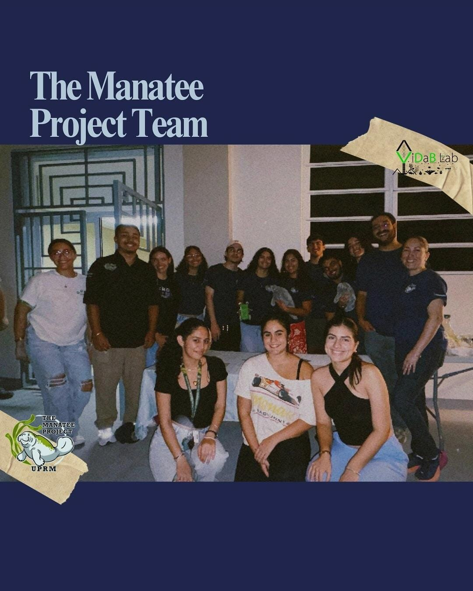
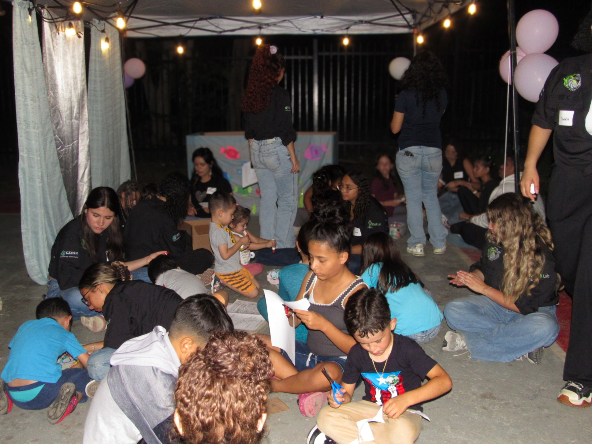
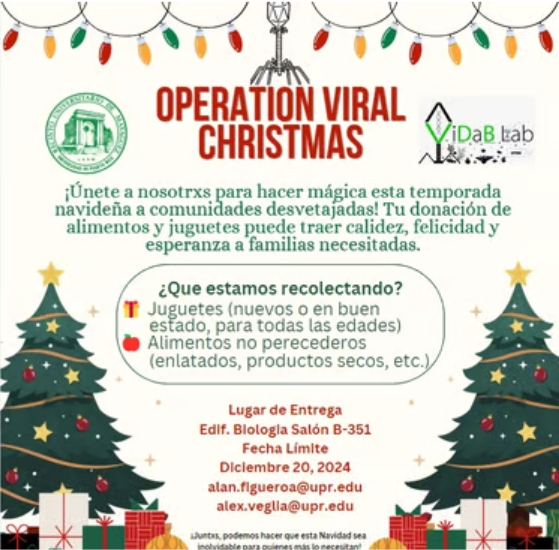
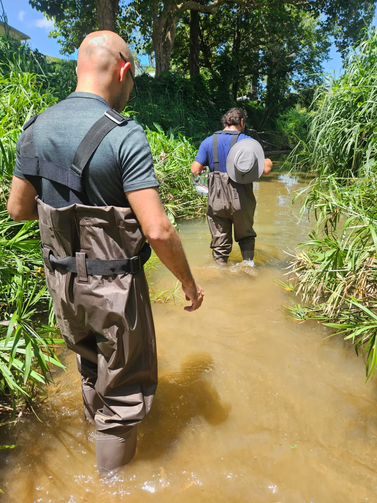
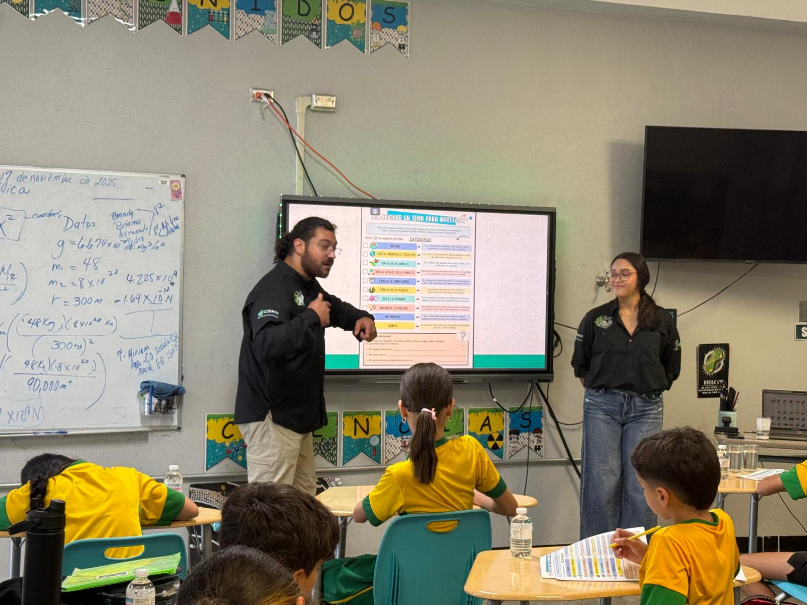
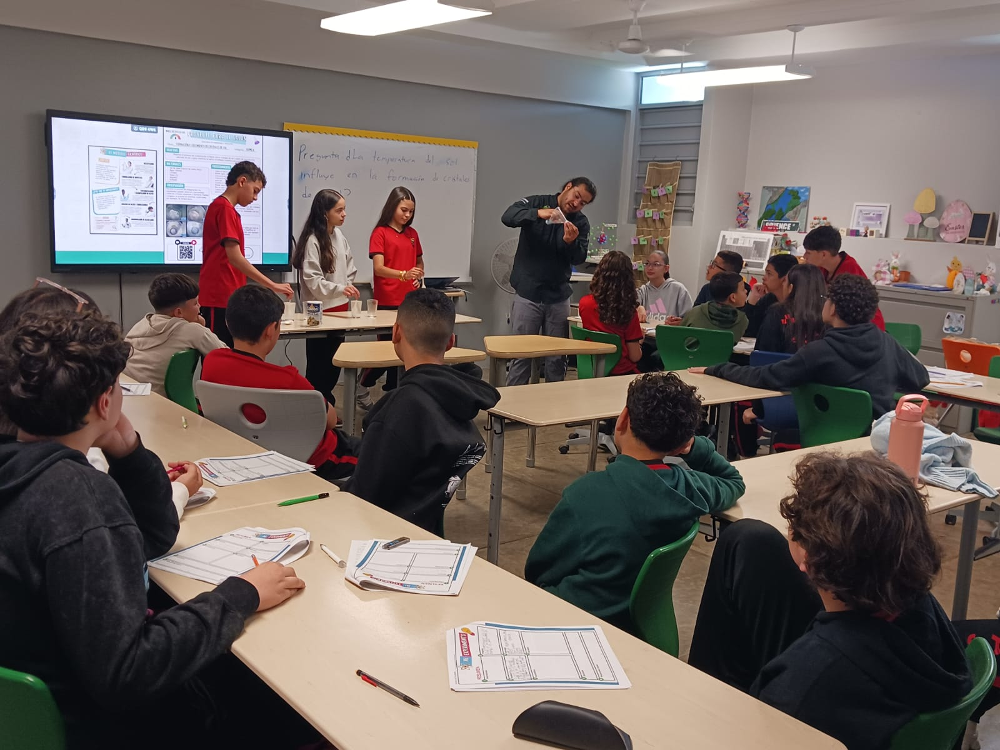
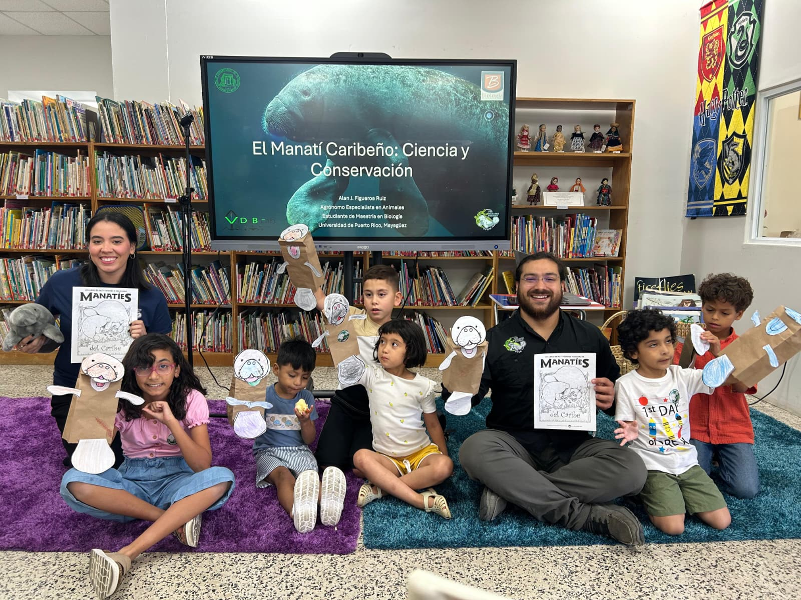
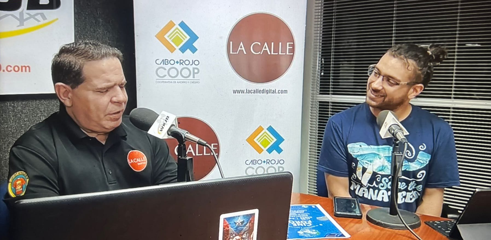
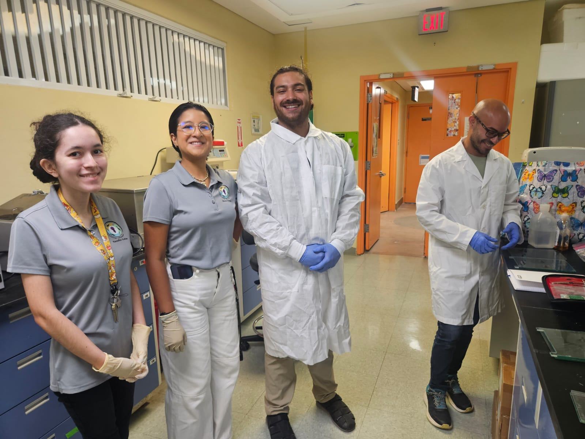
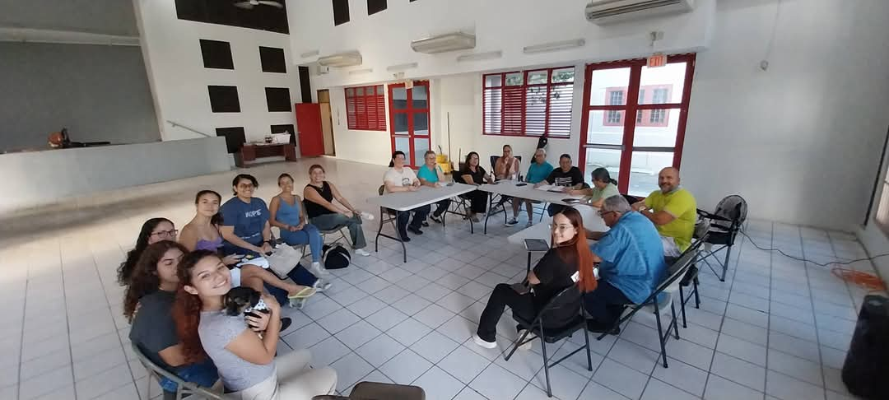

::: {.page-hero}
# Outreach

Community-based science, student training, conservation education, and public-facing One Health communication.
:::

::: {.section-block}

## Outreach pathways

::: {.gateway-grid}

::: {.gateway-card}
### Community

Conservation education connected to local ecosystems, species, and environmental concerns.
:::

::: {.gateway-card}
### Students

Research exposure, fieldwork, laboratory skills, data literacy, and professional development.
:::

::: {.gateway-card}
### WildCiencia

Public-facing science communication, visual storytelling, and future educational resources.
:::

::: {.gateway-card}
### Conservation action

Accessible science that supports belonging, care, and protection of local spaces.
:::

:::
:::

::: {.section-block}

## Outreach vision

I believe conservation becomes stronger when communities are not treated only as audiences, but as partners, knowledge holders, and caretakers of local spaces.

My outreach work is guided by the idea that people protect places more deeply when they develop belonging in those places.

:::

::: {.section-block}

## Community engagement model

::: {.expedition-grid}

::: {.expedition-card}
### Listen

Understand community connections to local ecosystems, species, and environmental concerns.
:::

::: {.expedition-card}
### Translate

Turn technical research into accessible language, visuals, stories, and educational materials.
:::

::: {.expedition-card}
### Train

Support students through research experiences, fieldwork, laboratory exposure, and communication skills.
:::

::: {.expedition-card}
### Return

Bring research knowledge back to communities through outreach, education, and public-facing resources.
:::

:::
:::

::: {.section-block}

## Outreach highlights

::: {.outreach-grid}

::: {.outreach-card}
{.outreach-thumb}

### Manatee Conservation Night

Community-centered conservation outreach focused on manatee health, coastal ecosystems, and environmental awareness.
:::

::: {.outreach-card}
{.outreach-thumb}

### Community movie-forum

Public engagement through film, discussion, and conservation education connected to local communities.
:::

::: {.outreach-card}
{.outreach-thumb}

### Operation Viral Christmas

A holiday outreach initiative connecting science, community support, and student-led engagement.
:::

::: {.outreach-card}
{.outreach-thumb}

### Teacher and student workshops

Hands-on learning experiences connecting field sampling, environmental health, and science education.
:::

:::
:::

::: {.section-block}

## Featured outreach entries

These entries document selected outreach, education, and community-based conservation activities connected to my work in wildlife disease ecology, One Health, and conservation science.

::: {.outreach-entry}

::: {.outreach-entry-image}

:::

::: {.outreach-entry-content}
### Manatee Conservation Night

::: {.badge-row}
[Community conservation]{.status-badge .badge-outreach}
[Manatee Project Puerto Rico]{.status-badge .badge-active}
[One Health outreach]{.status-badge .badge-theme}
:::

**Focus:** Manatee conservation, coastal ecosystems, environmental health, and community science  
**Format:** Community event, educational activities, and public conservation discussion  
**Related project:** Manatee Project Puerto Rico

Manatee Conservation Night was developed as a community-centered outreach activity connecting marine mammal conservation, environmental health, and public science communication. The event created a space to discuss the conservation of the Caribbean manatee, the importance of coastal ecosystems, and the ways communities can participate in conservation action.

This activity reflects my broader commitment to science that returns to communities, especially in Puerto Rican coastal and island contexts where people, wildlife, watersheds, and ecosystems are deeply connected.
:::

:::

::: {.outreach-entry}

::: {.outreach-entry-image}

:::

::: {.outreach-entry-content}
### Operation Viral Christmas

::: {.badge-row}
[Community outreach]{.status-badge .badge-outreach}
[Student engagement]{.status-badge .badge-theme}
[Science and service]{.status-badge .badge-type}
:::

**Focus:** Community support, student-led engagement, and science-connected outreach  
**Format:** Holiday outreach initiative  
**Related themes:** Community-based science, student training, public engagement

Operation Viral Christmas is a community-oriented outreach initiative that connects science, service, and student engagement. The activity reflects the idea that scientific communities can contribute beyond the laboratory by supporting local communities and building a culture of care, belonging, and public connection.

This initiative also represents the type of outreach I want to continue developing through WildCiencia: science that is visible, human, accessible, and connected to the people and places it serves.
:::

:::
:::

::: {.section-block}

## Outreach and media gallery

::: {.gallery-grid}

::: {.gallery-item}

:::

::: {.gallery-item}

:::

::: {.gallery-item}

:::

::: {.gallery-item}

:::

::: {.gallery-item}

:::

::: {.gallery-item}

:::
:::
:::

::: {.section-block}

## WildCiencia

WildCiencia is a developing science communication and outreach initiative focused on wildlife, conservation, One Health, environmental health, and Puerto Rican island science.

The goal is to translate research into accessible language, visual communication, and culturally relevant storytelling that can support environmental awareness and conservation action.

[Future WildCiencia website →](https://ajfigueroaruiz.github.io/wildciencia/){.button-inline}

:::