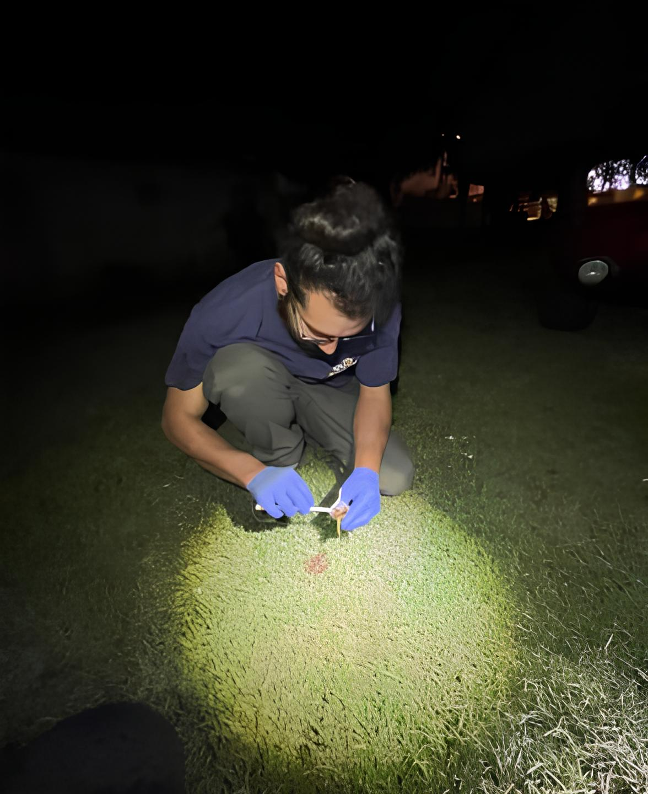
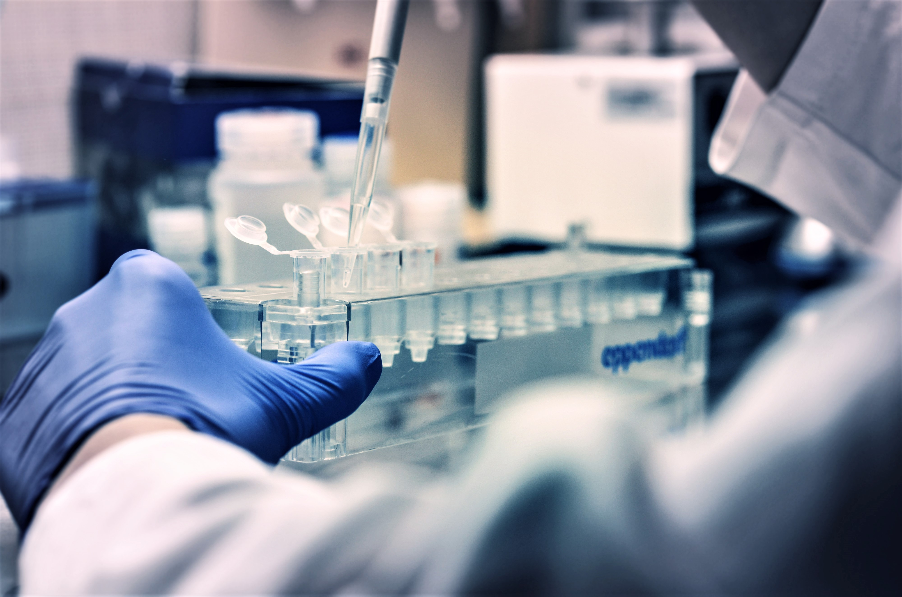
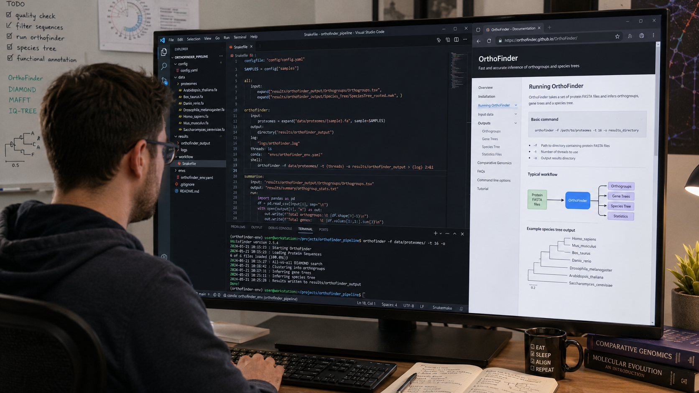
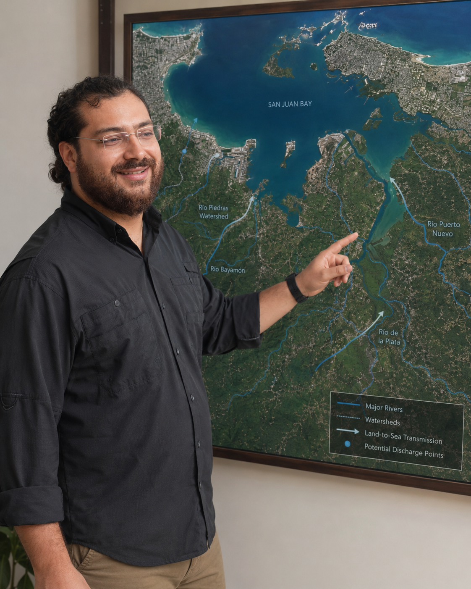
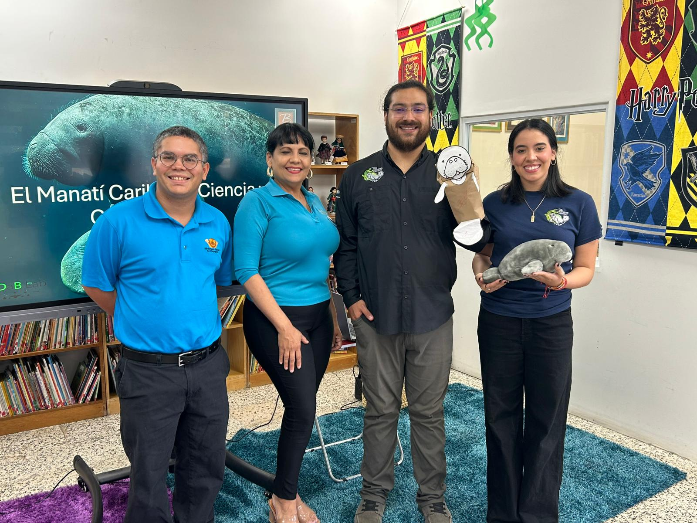
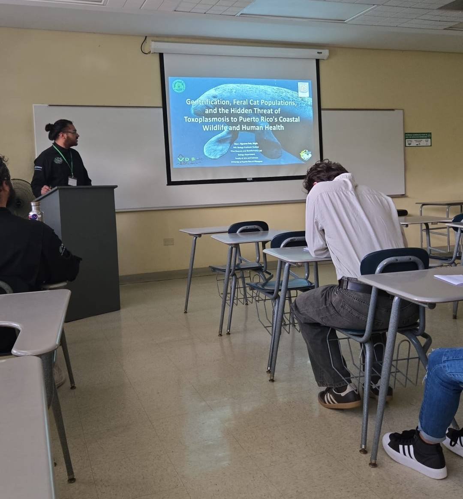

::: {.page-hero}
# Research

My research explores how pathogens, environmental change, and human-modified landscapes influence wildlife health, ecosystem health, and One Health outcomes.
:::

::: {.section-block}

## Research overview

My current work focuses on *Toxoplasma gondii* transmission across terrestrial, estuarine, and marine systems in Puerto Rico. I am especially interested in how oocyst contamination, runoff, stormwater pathways, coastal ecosystems, and manatee habitats may be connected through the land-sea interface.

This work is part of a broader research vision that integrates conservation physiology, wildlife medicine and disease ecology, reproductive biology, environmental diagnostics, epidemiology, bioinformatics, and community-centered conservation science.

:::

::: {.section-block}

## Field-to-conservation workflow

My research connects field observations, laboratory evidence, computational analysis, mapping, outreach, and academic conservation spaces. This workflow reflects how I want my science to move: from real landscapes and samples toward reproducible evidence, conservation interpretation, and public communication.

::: {.workflow-carousel}

::: {.workflow-slide}
{.workflow-image}

::: {.workflow-caption}
### 1. Field

Environmental and ecological questions begin in real landscapes, watersheds, coastal habitats, and human-modified systems.
:::
:::

::: {.workflow-slide}
{.workflow-image}

::: {.workflow-caption}
### 2. Lab

Field samples become biological evidence through microscopy, molecular diagnostics, DNA extraction, qPCR workflows, and careful sample processing.
:::
:::

::: {.workflow-slide}
{.workflow-image}

::: {.workflow-caption}
### 3. Code

R, GitHub, Quarto, data cleaning, visualization, and reproducible workflows help turn raw information into transparent analysis.
:::
:::

::: {.workflow-slide}
{.workflow-image}

::: {.workflow-caption}
### 4. Mapping

Spatial thinking helps connect mountains, rivers, cities, estuaries, coastal ecosystems, and manatee habitats through the land-sea interface.
:::
:::

::: {.workflow-slide}
{.workflow-image}

::: {.workflow-caption}
### 5. Conservation outreach

Science should return to communities through education, visual communication, student training, and public-facing conservation storytelling.
:::
:::

::: {.workflow-slide}
{.workflow-image}

::: {.workflow-caption}
### 6. Conservation in academia

Academic spaces can become bridges between research, conservation partners, students, communities, and future collaborative action.
:::
:::

:::

::: {.workflow-mini-map}

::: {.workflow-mini-step}
**Field**
:::

::: {.workflow-arrow}
→
:::

::: {.workflow-mini-step}
**Lab**
:::

::: {.workflow-arrow}
→
:::

::: {.workflow-mini-step}
**Code**
:::

::: {.workflow-arrow}
→
:::

::: {.workflow-mini-step}
**Mapping**
:::

::: {.workflow-arrow}
→
:::

::: {.workflow-mini-step}
**Outreach**
:::

::: {.workflow-arrow}
→
:::

::: {.workflow-mini-step}
**Academia**
:::

:::

::: {.scroll-note}
Scroll sideways to explore the workflow →
:::

:::

::: {.section-block}

## Research gateways

::: {.gateway-grid}

::: {.gateway-card}
### Disease ecology

Pathogen movement, environmental exposure, host-pathogen systems, and wildlife health.
:::

::: {.gateway-card}
### Conservation physiology

Biological responses to stressors, disease, environmental change, and human-modified landscapes.
:::

::: {.gateway-card}
### One Health

Connections among humans, animals, community animals, watersheds, coastal systems, and wildlife.
:::

::: {.gateway-card}
### Reproducible research

R, GitHub, Quarto, mapping, bioinformatics, transparent workflows, and public documentation.
:::

:::
:::

::: {.section-block}

## Field-to-conservation model

::: {.workflow-grid}

::: {.workflow-step}
### 1. Ecological setting

Identify the landscape, species, habitat, watershed, or human-modified system where the conservation question emerges.
:::

::: {.workflow-step}
### 2. Exposure pathway

Evaluate how pathogens, stressors, or environmental contaminants may move through that system.
:::

::: {.workflow-step}
### 3. Biological evidence

Use field sampling, laboratory methods, diagnostics, and data analysis to characterize patterns.
:::

::: {.workflow-step}
### 4. Conservation interpretation

Translate results into wildlife health, One Health, education, outreach, and decision-making contexts.
:::

:::
:::

::: {.section-block}

## Focal systems

::: {.species-grid}

::: {.species-card}
### Caribbean manatee

Marine mammal conservation, coastal habitat, environmental exposure, and health risk interpretation.
:::

::: {.species-card}
### *Toxoplasma gondii*

Environmental persistence, land-sea movement, host-pathogen interaction, and One Health relevance.
:::

::: {.species-card}
### Human diagnostic records

Retrospective epidemiological data that help build a human-health layer into Puerto Rico’s One Health picture.
:::

::: {.species-card}
### Zebrafish ZF4 cells

A comparative cellular system that helps connect exposure questions to host-pathogen biology.
:::

:::
:::

::: {.section-block}

## Methods and tools

::: {.tag-list}
Environmental sampling
Field metadata
Microscopy
DNA extraction
qPCR workflows
R
RStudio
GitHub
Quarto
GIS
Bioinformatics
Scientific writing
Science communication
:::

:::

::: {.section-block}

## Long-term vision

My long-term goal is to develop a research program that connects wildlife disease ecology, veterinary science, conservation physiology, reproductive biology, and One Health to understand how environmental change affects threatened species.

I am especially interested in research that is useful for conservation decision-making, transparent through reproducible workflows, and accessible to the communities connected to the ecosystems being studied.

:::